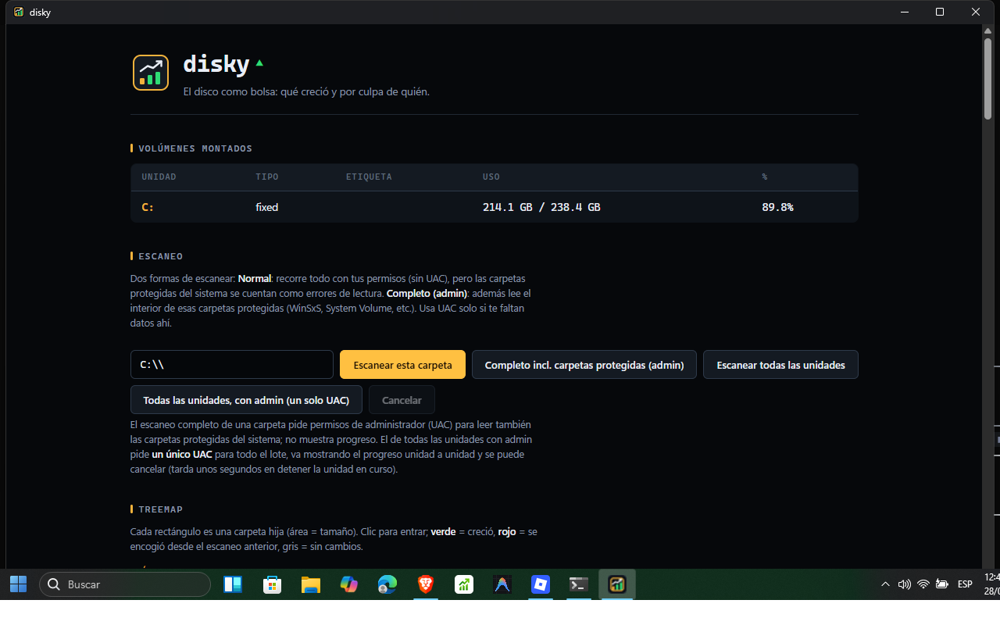
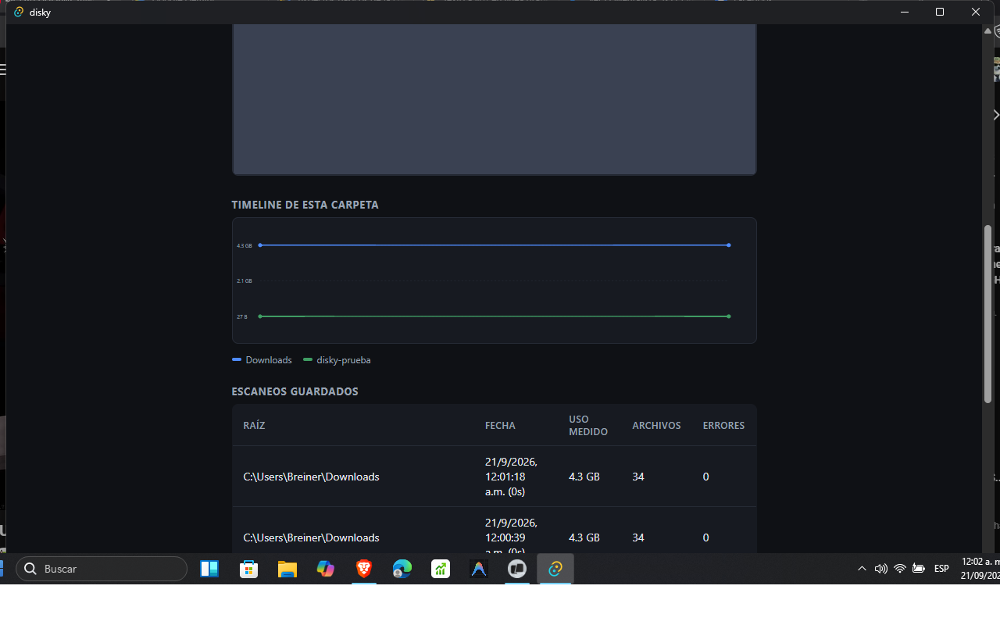
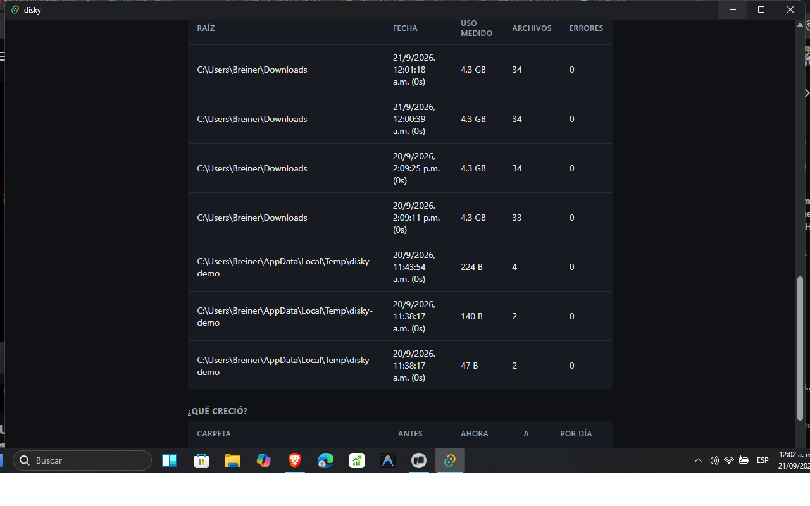

<p align="center"></p>

<p align="center"><strong>¿Qué creció en mi disco y por culpa de quién?</strong></p>

WinDirStat te dice cuánto pesa cada carpeta *hoy*. disky te dice **qué creció
desde la semana pasada y por culpa de quién**: *"Discord creció 6 GB en 3 días"*.

Solo lectura, 100% local, sin servidores.

## Capturas

> Capturas de la identidad actual. Para regenerarlas, abre la app y corre
> `scripts/captura.ps1 -Nombre treemap` (la ventana debe estar en la sección que
> quieras retratar).







## La identidad: el disco como bolsa

disky no es un panel de ajustes, es una **cinta de cotizaciones**. La idea que
lo justifica es que el disco cotiza: cada carpeta es un activo, y lo que importa
no es cuánto pesa, sino **cuánto cambió**. La interfaz entera sale de ahí.

- Casi negro de fondo, para que manden las cifras.
- **Todo número va en monoespaciada con cifras tabulares**: se alinean en columna
  y se comparan de un vistazo.
- La columna **Δ** lleva flecha, signo y una barra de magnitud proporcional al
  mayor delta de la tabla. Es el corazón de la cinta.
- El color tiene reglas estrictas, porque un color que significa dos cosas no
  significa ninguna:

| Token | Color | Qué significa |
|---|---|---|
| `--alza` | verde `#2fdc75` | **creció** desde el escaneo anterior |
| `--baja` | rojo `#ff4d6d` | **se encogió** |
| `--plano` | gris `#3d4959` | sin cambios medidos |
| `--acento` | ámbar `#f2b23c` | la marca y lo estructural: la acción principal, la astilla de sección, el logo |
| `--error` | rojo `#ff4d4d` | un fallo real (unidad ilegible), **no** "se encogió" |

**La dirección nunca depende del color:** siempre va con flecha (`▲`/`▼`) y
signo. Verde y rojo son justo el par que peor se distingue con daltonismo, y la
cinta tiene que leerse sin él.

El ámbar tampoco significa "creció": significa *disky*. Una fila que pasó el
umbral de alerta se pinta en ámbar a propósito, porque un crecimiento fuerte no
es una dirección, es un aviso de la app.

Todo esto vive en `src/styles.css`, que es la fuente de verdad de la paleta. El
icono y el banner se generan de la misma geometría con
`python scripts/gen_marca.py`.

## Estado

✅ **MVP completo: escaneo sin admin + UAC + treemap + timeline + «¿qué cambió?».**

> **Panel USN (primer corte).** `¿Qué cambió?` lee los cambios recientes del
> `$UsnJrnl`, reconstruye la ruta de cada uno desde la MFT (el journal solo da
> FRN + nombre) y los lista. Corre en un hijo elevado con UAC —el kernel exige
> `GENERIC_READ` al volumen— por el mismo canal de archivo JSON que el escaneo
> elevado: es una **foto del momento, no un watcher en vivo**. Ese watcher sigue
> pendiente porque necesita un canal inverso desde el proceso elevado.
>
> **Un escaneo sin carpetas no se guarda.** Si la lectura no emite ni un
> directorio (típico de un `$MFT` ilegible que devuelve el índice vacío) el
> snapshot se descarta con rollback: no es «un escaneo vacío», es una línea base
> envenenada que dejaría el treemap y el timeline en blanco, porque ambos leen
> el escaneo **más reciente** de la raíz. Al arrancar se borran los que hubieran
> quedado de versiones anteriores.

- ✅ Pipeline end-to-end funcional: volúmenes reales (Win32) → core → Tauri → UI.
- ✅ Parser de registros `USN_RECORD_V2` probado con buffers sintéticos.
- ⚠️ Leer la MFT/journal exige **proceso elevado**; las pruebas de integración
  reales quedan `#[ignore]` y se corren en una máquina local elevada
  (`cargo test -p disky-core -- --include-ignored`). El runner de CI no puede.
- ✅ **Escaneo sin admin**: walker portable en post-orden (`std::fs`) que emite
  cada directorio con el roll-up de su subárbol, cancelable y con progreso en
  vivo por eventos.
- ✅ **Snapshots en SQLite** (`rusqlite`, WAL): escritura atómica (invisible
  hasta `finish`; rollback si se cancela), prune de los últimos 10 por raíz,
  esquema versionado (`user_version = 1`).
- ✅ **Diff "¿qué creció?"**: comparación de los dos snapshots de una raíz vía
  `match_by_path` + `growth_ranking` (las mismas funciones puras del dominio).
### Escaneo rápido con UAC (lectura vía MFT)

El escaneo completo se relanza a sí mismo elevado (`--elevated-scan`) y lee el
**`$MFT` del volumen** (rápido, cubre carpetas protegidas); si el volumen no es
NTFS o el formato sorprende, cae al walker sin admin. El snapshot se guarda
desde el hijo y el resultado se reporta por JSON. Los **cambios recientes del
journal** (`$UsnJrnl`) siguen en el roadmap: exigirían un lector elevado a
demanda para alimentar un panel "qué cambió" (no solo "qué creció").
- ✅ **Drill-down**: clic en cualquier carpeta del ranking para ver el crecimiento
  de sus hijos directos (navegable en profundidad, con "volver").
- ✅ **Treemap squarify** (Bruls et al. 2000): implementación pura en el core
  (probada: cobertura sin solapes, aspect ratios acotados), SVG en el frontend
  con colores por crecimiento, breadcrumb y navegación por clic.
- ✅ **Timeline multi-línea**: la serie temporal de la carpeta vista y sus hijos
  más grandes, en un solo gráfico comparable (escala común, leyenda, tooltips).

## Guía de usuario

### Primeros 5 minutos

1. Escribe una ruta en el campo de escaneo (ej. `C:\Users\tu-usuario\Downloads`).
2. Pulsa **Escanear** y espera la barra de progreso.
3. Crea, borra o agranda algunos archivos de esa carpeta.
4. Escanea **la misma ruta** otra vez → aparece todo lo demás.
5. Lee **¿Qué creció?**, explora el **treemap** y mira el **timeline**.

Con dos escaneos de la misma raíz, disky tiene todo lo que necesita.

### Volúmenes montados

Tabla informativa de arranque: unidad, tipo (fija, extraíble, remota…),
etiqueta, uso y porcentaje. No requiere acción.

```
Unidad   Tipo   Etiqueta   Uso                %
C:       Fija   Windows    412 GB / 931 GB    44%
D:       Fija   Datos      1.2 TB / 1.8 TB    67%
```

### Escaneo

```
[ C:\Users\tu-usuario\Downloads ] [Escanear] [Escaneo rápido (admin)] [Cancelar]
  ▓▓▓▓▓▓▓▓▓░░░░░░░  12.480 carpetas · 340.112 archivos · 18,4 GB leídos
```

- **Escanear** (sin admin): recorre el árbol con permisos normales y guarda un
  snapshot en SQLite. Muestra progreso en vivo y se puede **cancelar** sin
  dejar rastro (el snapshot nunca se llega a guardar a medias).
- **Escaneo rápido (admin)**: Windows pide el permiso UAC y disky se relanza
  elevado para leer también las carpetas protegidas del sistema. No muestra
  progreso ni se puede cancelar mientras corre (dura poco).
- Las carpetas sin permiso **no abortan nada**: se cuentan como *errores de
  lectura* y aparecen en la tabla de escaneos guardados.
- Se conservan los **últimos 10 escaneos por raíz**; los más viejos se podan
  solos. La BD vive en `%APPDATA%\com.breiner.disky\snapshots.db`.

### ¿Qué creció?

La respuesta de disky, ordenada por crecimiento: la comparación entre los dos
escaneos más recientes de la raíz escaneada.

```
Carpeta                          Antes    Ahora      Δ      Por día
...\Downloads\Torrents           3,1 GB   6,4 GB  +3,3 GB   +820 MB
...\Cache                        42 B     140 B     +98 B    +25 B
...\Temp\disky-demo\Docs         5 B      0 B        −5 B    −2 B
```

- Δ en **verde** creció, en **rojo** se encogió, y siempre con `▲`/`▼` y el
  signo: la dirección se lee aunque el color no ayude.
- Bajo cada Δ, la barra de la cinta es proporcional al mayor delta de esa tabla.
- **Por día** normaliza el delta a la distancia entre escaneos.
- **Clic en cualquier fila** → drill-down: los hijos directos de esa carpeta,
  con su propio delta (y así en profundidad, con enlace «↑ volver»).
- El desplegable junto al título fija la **línea base**: por defecto el
  escaneo inmediatamente anterior al más reciente, o cualquier snapshot más
  viejo de esa misma raíz («¿cuánto creció esto desde hace un mes?»).
- El botón **⌖** de cada fila abre la carpeta en el explorador de Windows.
- Si la ventana está en segundo plano y algún delta supera el umbral
  configurado (MB), salta una **notificación del sistema** con la carpeta
  culpable.
- El desplegable **mostrar** filtra a *solo lo que creció* o *solo lo que se
  encogió* (las barras se re-escalan a lo visible).
- El botón **Exportar CSV** guarda el informe en Descargas (separador `;`, apto
  para Excel en español) y lo revela en el explorador. Es la única escritura de
  disky y nunca toca nada escaneado.
- El **umbral** de alerta y el **filtro** se recuerdan entre sesiones.
- El diff se calcula **en streaming**: solo se materializa el escaneo más
  reciente; el anterior se recorre en orden y se empareja por ruta con
  bisección (`GrowthTop`). Con un `C:` de 226 000 carpetas el top-50 sale
  idéntico al cálculo por lotes, gastando mucha menos memoria (antes eran dos
  snapshots completos más un `HashMap` con todas las rutas para quedarse con 50
  filas).

### ¿Qué cambió? (journal de NTFS)

```
Cuándo        Cambio                        Ruta
14:23:51      extend · close                C:\Users\tu-usuario\Downloads\backup.iso
14:23:47      create · close                C:\Users\tu-usuario\AppData\Local\Temp\0.tmp
14:19:02      rename_old · rename_new       C:\Program Files\App\viejo.exe
```

- Los cambios más recientes que registró el journal del volumen: **qué** archivo,
  qué le pasó (creado, extendido, truncado, borrado, renombrado, cerrado) y
  **dónde**. Es la respuesta al «¿qué cambió?» que «¿qué creció?» solo aproxima
  entre dos escaneos.
- El journal guarda **FRN + nombre**, no rutas: por eso las rutas se reconstruyen
  barriendo el índice de la MFT **una sola vez** para todos los FRN del lote.
- Cuando ni el archivo ni su carpeta siguen en la MFT (se borraron antes del
  escaneo) la fila lo dice en vez de inventarse una ruta.
- **Requiere permisos de administrador** (los FSCTL del journal exigen
  `GENERIC_READ` al volumen), así que Windows pedirá el UAC. Si cancelas, no pasa
  nada: el resto de la app funciona igual sin admin.
- Es una **consulta a demanda**, no un vigilante: no se refresca sola ni avisa
  cuando algo cambia. Eso queda para el watcher con canal inverso del roadmap.

### Duplicados probables

```
Archivo        Tamaño   Copias   Desperdicio   Ubicaciones
backup.iso     40,0 GB      3        80,0 GB   C:\…\backup.iso
                                               D:\…\backup.iso
                                               E:\…\backup.iso
```

- Criba los **archivos grandes (≥ 32 MiB)** que comparten **nombre y tamaño**
  exactos: los candidatos obvios a duplicado, ordenados por desperdicio
  (`(copias − 1) × tamaño`).
- **No es un hash**: mismo nombre y tamaño *sugiere* el mismo contenido, así que
  puede haber falsos positivos; por eso la app los llama *probables* y cada
  copia se revela en el explorador para decidir a mano.

### Treemap

```
┌────────────────┬───────┬──────────────────┐
│                │ Cache │                  │
│   Torrents     │ (verde│     Steam        │
│   (grande)     │   🟢) │                  │
│                ├───────┴──────────────────┤
├────────────────┴───────┬──────────────────┤
│  [archivos]            │  Docs (naranja)  │
└────────────────────────┴──────────────────┘
raíz › Torrents › 2026-09            ← breadcrumb
```

- Cada rectángulo es un hijo directo; el **área = tamaño** (algoritmo
  *squarify*, rectángulos lo más cuadrados posible).
- **Clic para entrar** a una carpeta; breadcrumb navegable para volver.
- El nodo sintético `[archivos]` agrupa los ficheros sueltos de la carpeta.
- **Verde** = creció desde el escaneo anterior, **rojo** = se encogió,
  gris = sin cambios. Se refresca solo tras cada escaneo.

### Timeline

```
      224 ┤                          ●── raíz
      140 ┤            ●─────────●──┬── Cache
        5 ┤ ●━━━━━━━━●              └── Docs
          └────────────────────────────
            esc.1      esc.2     esc.3
```

- Una línea por carpeta: la que estás viendo (según el treemap/breadcrumb) y
  sus hasta 5 hijos más grandes, con **escala temporal y de bytes comunes**.
- Pasa el mouse por un punto: fecha, tamaño y delta respecto al punto anterior.
- Leyenda bajo el gráfico con el color de cada carpeta.
- Necesita **al menos dos escaneos** para dibujar; las series sin suficientes
  puntos se descartan sin romper el resto.

### Escaneos guardados

Historial de la raíz escaneada (raíz, fecha, uso medido, archivos, errores de
lectura). Útil para confirmar cuándo se tomó cada snapshot.

### Preguntas frecuentes

**La UI dice «Aún no hay escaneos de esta raíz» pero yo escaneé esa carpeta.**
Comprueba que la ruta sea exactamente la misma. Desde la versión con
normalización de separadores, `C:/x` y `C:\x` son equivalentes; antes de ese
arreglo, los escaneos hechos desde consola podían quedar bajo otra clave.

**Windows marcó el instalador como sospechoso (SmartScreen).**
El instalador no está firmado con certificado de código (cuesta dinero).
«Más información» → «Ejecutar de todas formas». Es molestia, no bloqueo.

**Cancelé el UAC del escaneo rápido.**
No pasa nada: disky lo detecta y te lo dice; el escaneo normal sigue disponible.

**¿Puede borrar o mover archivos?** No. disky es **solo lectura** por diseño:
escanea, compara y muestra.

### Capturas de pantalla

Genera las capturas de cada sección con el script incluido (necesita la app
abierta):

```powershell
powershell -File scripts/captura.ps1 -Nombre treemap   # → docs/screenshots/treemap.png
```

El icono, el logo y el banner del README se regeneran desde la misma geometría
de la marca (una sola fuente para los tres):

```bash
python scripts/gen_marca.py    # → src-tauri/icons/* y docs/logo/*
```

## Roadmap

1. ~~Spike USN Journal~~ ✅ — parser + FSCTL probados; límite de elevación documentado
2. ~~Escaneo base sin admin + snapshot en SQLite~~ ✅ — walker, store atómico y diff
3. ~~Escaneo rápido con UAC~~ ✅ — hijo elevado con `--elevated-scan`
4. ~~Treemap squarify~~ ✅ — core puro + SVG interactivo con breadcrumb
5. ~~Timeline de crecimiento~~ ✅ — serie por carpeta + comparación multi-línea
6. ~~Primer corte del panel «¿qué cambió?»~~ ✅ — journal + rutas desde la MFT, a demanda con UAC
7. Watcher del journal en vivo (canal inverso desde el proceso elevado)
8. Agente elevado compartido con Frostbyte (opción B), a futuro

## Arquitectura (hexagonal)

| Pieza | Rol |
|---|---|
| `crates/disky-core` | Dominio puro + adaptadores de plataforma. Sin UI, sin IPC, 100% testeable |
| `src-tauri` | Shell delgado: traduce comandos IPC a llamadas del core, nada más |
| `src/` | Frontend TypeScript (vanilla por ahora) |

**Regla de oro:** la lógica vive en el core; el shell traduce, no decide.

## Desarrollo

```bash
npm install
npm run tauri dev
```

### Binario suelto: usa `npm run tauri build`, no `cargo build --release`

`target/release/disky.exe` solo funciona por sí solo si se compiló con
`npm run tauri build`: así la CLI incrusta `dist/` dentro del ejecutable. Un
`cargo build --release` a secas deja el binario en **modo dev**, apuntando a
`http://localhost:1420`; sin un Vite corriendo, la ventana muestra «no se pudo
acceder a la página» — que es justo lo que rompe el acceso directo del
escritorio.

## Distribución

```bash
npm run tauri build        # genera instalador NSIS + ejecutable
```

Artefactos en `target/release/bundle/nsis/`. Nota: sin certificado de firma de
código, SmartScreen mostrará una advertencia la primera vez — es molestia, no
bloqueo. Eso y el auto-actualizador son cosas distintas: el updater va con
firma minisign propia y sí es gratis (ver abajo).

### Releases automáticas (CI)

Al empujar un tag de versión se compila y publican los instaladores solos:

```bash
git tag v0.1.0 && git push origin v0.1.0
# → GitHub Actions compila en windows-latest y adjunta a la release:
#   disky_0.1.0_x64-setup.exe (NSIS) y disky_0.1.0_x64_en-US.msi
```

El workflow (`.github/workflows/release.yml`) valida antes de compilar (fail
fast) que el tag coincida con la versión de `tauri.conf.json` y que el secret
con la clave de firma decodifique como clave minisign: así un secret mal pegado
no se descubre tras diez minutos de compilación.

### Actualizaciones automáticas (gratis)

Al arrancar, disky consulta el `latest.json` de la última release y, si hay
versión nueva, ofrece instalarla en caliente (NSIS, sin reinstalar a mano).
La app verifica la firma **minisign** de cada artefacto con la clave pública
embebida en `tauri.conf.json`.

Ojo con la confusión de nombres, porque son dos firmas diferentes:

| | Qué evita | Precio |
|---|---|---|
| **Firma de código** (Authenticode) | El aviso de SmartScreen al instalar | Certificado anual, **no** se usa aquí |
| **Firma del updater** (minisign) | Que alguien inyecte un instalador falso | Clave propia en tu máquina, **gratis** |

Solo la primera cuesta dinero. La segunda es la que consume la app al
actualizarse y basta con que la clave pública del binario y la privada que
firma en CI sean la misma pareja.

Para que CI pueda firmar hacen falta dos secrets del repositorio
(**Settings → Secrets and variables → Actions**):

| Secret | Valor |
|---|---|
| `TAURI_SIGNING_PRIVATE_KEY` | Contenido de `src-tauri/.tauri/disky.key` (nunca al repo) |
| `TAURI_SIGNING_PRIVATE_KEY_PASSWORD` | Su contraseña; **vacío** si la clave se generó sin una |

La clave se genera una vez, sin contraseña (no hay nada que guardar aparte):

```bash
npx tauri signer generate -w src-tauri/.tauri/disky.key -p "" -f
```

El `.pub` resultante se copia en `plugins.updater.pubkey` de
`tauri.conf.json`. Si la clave se pierde hay que regenerar la pareja y
actualizar el `.pub`: las instalaciones antiguas no podrán verificar las firmas
nuevas y necesitarán una instalación manual **una sola vez** — los instaladores
de la release siguen valiendo siempre.

## Calidad

```bash
cargo fmt --all -- --check                               # formato
cargo clippy --workspace --all-targets -- -D warnings    # pedantic + deny
cargo test -p disky-core                                 # tests (los de integración: --include-ignored, elevado)
npx tsc --noEmit                                         # typecheck del frontend
```

CI (`.github/workflows/ci.yml`): formato, clippy estricto y los tests del core
en un runner Windows estándar, y el frontend (tsc + build) en uno de Linux.
Los tests de integración que exigen acceso al dispositivo (`#[ignore]`) se
corren aparte, en una máquina local elevada: `cargo test -p disky-core --
--include-ignored`.
Releases (`.github/workflows/release.yml`): tag `v*` → instaladores NSIS/MSI
adjuntos a la GitHub Release, junto con los `.sig` y el `latest.json` que
consume el auto-actualizador.
